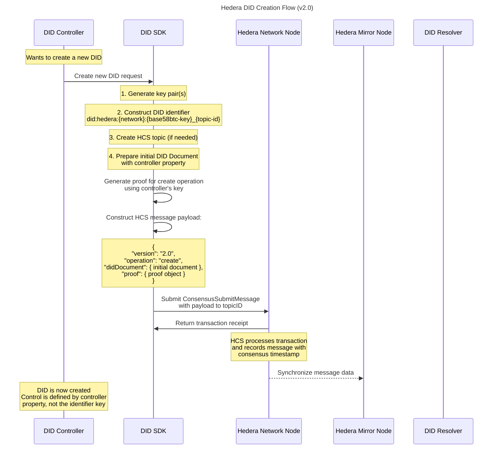

# Hedera DID Creation Flow

This sequence diagram illustrates the process of creating a new Decentralized Identifier (DID) on the Hedera network. The flow shows how a DID Controller interacts with the DID SDK to generate cryptographic keys, construct the DID identifier, create a Hedera Consensus Service (HCS) topic if needed, and prepare the initial DID Document. The diagram highlights how proof is generated using the controller's key and how the message payload is submitted to the Hedera network, ultimately resulting in a fully created DID that's defined by its controller property rather than the identifier key itself.

