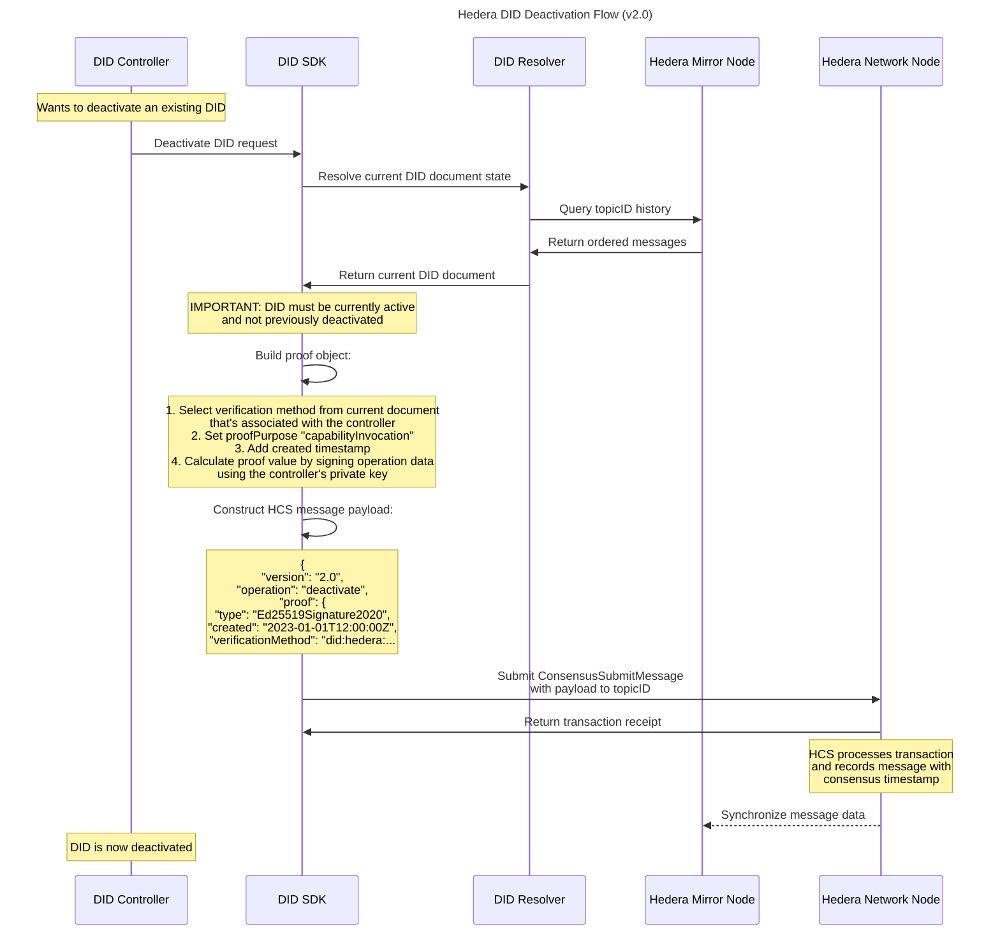

# Hedera DID Deactivation Flow

This sequence diagram demonstrates the process of deactivating an existing Decentralized Identifier (DID) on the Hedera network. The diagram shows the interaction between the DID Controller, DID SDK, DID Resolver, and Hedera network components. It outlines how the current DID document state is resolved before deactivation, the importance of verifying the DID is currently active, and the process of building a proof object using the controller's private key. The diagram illustrates how a deactivation message is constructed and submitted to the Hedera Consensus Service (HCS), resulting in the permanent deactivation of the DID.

