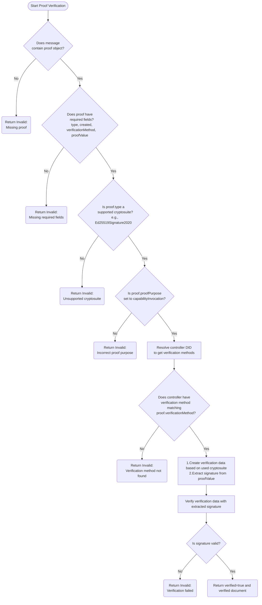

# Hedera DID Proof Verification Flow

This flowchart illustrates the systematic process for verifying cryptographic proofs within Hedera DID operations. The diagram presents a step-by-step validation sequence that checks for the presence of a proof object, validates required fields (type, created, verificationMethod, and proofValue), confirms the cryptosuite is supported, and verifies the proof purpose is set to "capabilityInvocation." The flow then resolves the controller DID to access verification methods, prepares verification data based on the cryptosuite, and validates the signature. Each validation step has clear error paths, ensuring thorough verification before confirming a DID operation as authentic.

