# Hedera DID Resolution Sequence

This sequence diagram details the comprehensive process of resolving a Hedera Decentralized Identifier (DID). The diagram illustrates the interactions between a Client, DID Resolver, Hedera Mirror Node, and Verifier, outlining the seven key phases of resolution: initialization, processing setup, message validation, and handling of create, update, and deactivate operations, followed by result determination. It highlights how the resolver processes each message chronologically, validates proofs differently for self-controlled versus externally controlled DIDs, and delivers appropriate responses based on the DID's current state. This resolution flow ensures that only properly authenticated operations are recognized when constructing the current state of a DID document.

```mermaid
sequenceDiagram
    participant C as Client
    participant R as DID Resolver
    participant M as Hedera Mirror Node
    participant V as Verifier

    C->>R: Resolve(did:hedera:network:key_topicID)

    Note over R: 1. INITIALIZATION
    R->>R: Parse DID and extract components
    R->>R: Validate DID format

    alt Invalid DID Format
        R-->>C: Error: invalidDid
    else Valid DID Format
        R->>M: Query messages for TopicID
        M->>R: Return all topic messages

        Note over R: 2. PROCESSING SETUP
        R->>R: Sort messages by consensus timestamp and sequence number
        R->>R: Initialize didState = null, currentController = null, isDeactivated = false

        loop Process Each Message
            Note over R: 3. MESSAGE VALIDATION
            R->>R: Parse message JSON
            R->>R: Check if valid JSON with version=2.0

            Note over R: 4. CREATE OPERATION
            alt Valid CREATE operation && didState is null
                R->>R: Extract didDocument and controller

                alt Self-controlled DID
                    R->>V: Validate proof using didDocument verification methods
                else Externally controlled DID
                    R->>R: Recursively resolve controller DID
                    R->>V: Validate proof using controller's verification methods
                end

                alt Proof is Valid
                    R->>R: Set didState = didDocument
                    R->>R: Set currentController = didDocument.controller
                end
            end

            Note over R: 5. UPDATE OPERATION
            alt Valid UPDATE operation && didState exists && DID not deactivated
                R->>R: Extract didDocument

                alt Self-controlled DID
                    R->>V: Validate proof using current didState verification methods
                else Externally controlled DID
                    R->>R: Recursively resolve controller DID
                    R->>V: Validate proof using controller's verification methods
                end

                alt Proof is Valid
                    R->>R: Update didState = didDocument
                    R->>R: Update currentController = didDocument.controller
                end
            end

            Note over R: 6. DEACTIVATE OPERATION
            alt Valid DEACTIVATE operation && didState exists && DID not deactivated
                alt Self-controlled DID
                    R->>V: Validate proof using current didState verification methods
                else Externally controlled DID
                    R->>R: Recursively resolve controller DID
                    R->>V: Validate proof using controller's verification methods
                end

                alt Proof is Valid
                    R->>R: Mark DID as deactivated
                    R->>R: Store deactivation metadata
                end
            end
        end

        Note over R: 7. RESULT DETERMINATION
        alt didState is null
            R-->>C: Error: notFound
        else DID is deactivated
            R-->>C: Return deactivated status + metadata
        else DID is active
            R-->>C: Return resolved DID Document
        end
    end
```

