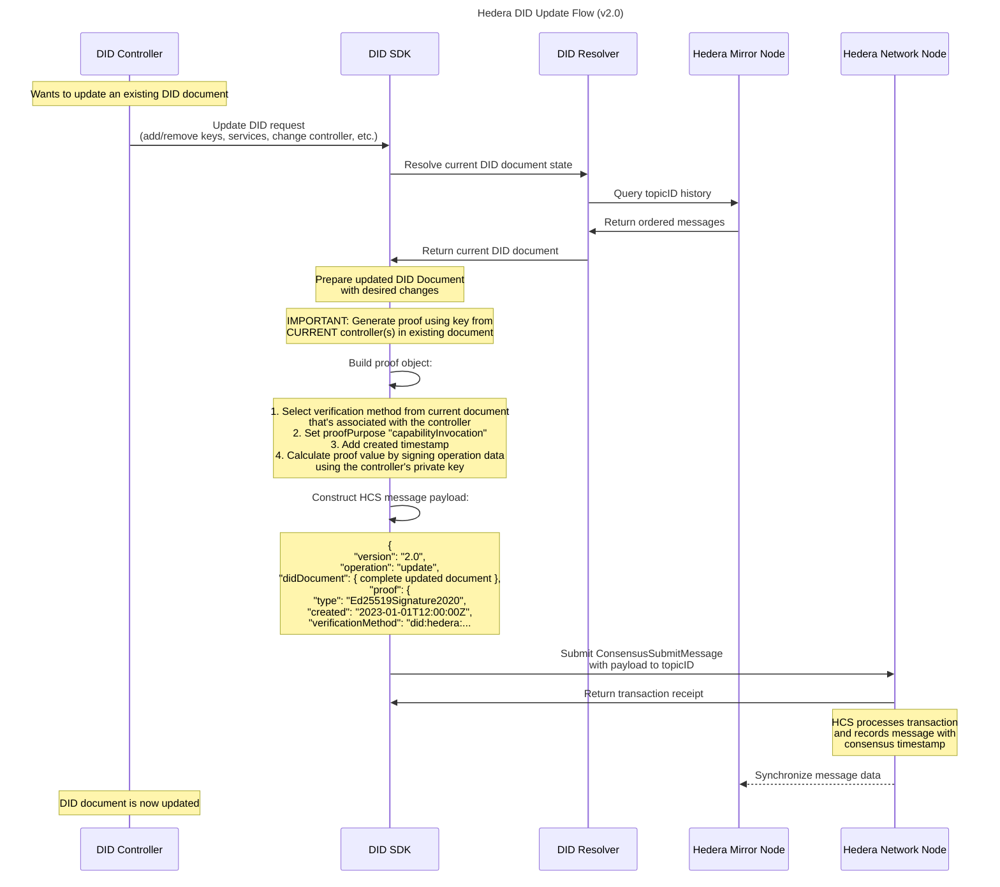

# Hedera DID Update Flow

This sequence diagram illustrates the process of updating an existing Decentralized Identifier (DID) document on the Hedera network. The diagram shows how a DID Controller can request modifications such as adding or removing keys, updating services, or changing the controller. It highlights the critical requirement that proof must be generated using the current controller's key from the existing document. The flow demonstrates how the DID SDK resolves the current document state, prepares the updated document, builds a proper proof object, and submits the update message to the Hedera Consensus Service (HCS), resulting in an updated DID document.

